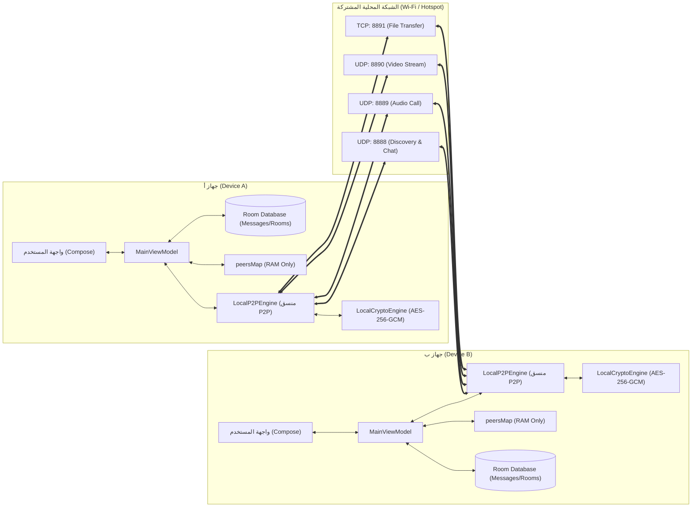

# Software Requirements Specification (SRS)

## 1. Document Information

- **Project Name:** LOCAL CONTACT
- **Document Title:** Software Requirements Specification (SRS)
- **Baseline Commit:** `71111825645c2b3c6a926f739455c4ffda3c0963`
- **Document Version:** 1.3 (Final Verified Paths & Flow Specification)
- **Date:** 2026-09-11
- **Status:** Baseline / Academic Defense Preparation
- **Document Scope:** مواصفات المتطلبات البرمجية المستخرجة تحليلياً من الكود الفعلي وملف الأساس `docs/Baseline.md`، مع تصنيف دقيق لواقع التنفيذ البرمجي ومطابقته التامة للشجرة الفعلية لملفات المشروع ومحتوياتها.

---

## Requirement Classification (تصنيف المتطلبات)

لتجنب الخلط الأكاديمي والتقني أثناء المراجعة ومناقشة المشروع، يتم تصنيف كافة البنود والملاحظات الواردة في هذه الوثيقة وفق المستويات الخمسة التالية:

1. **Official Requirement (متطلب رسمي):**
   - **التعريف:** المتطلبات والوظائف والمعايير التي طُلبت صراحة وبشكل رسمي من قبل المشرف الأكاديمي / الدكتور أو وردت في وثيقة التكليف الرسمية للمشروع.
   - **المحددات:** أي رقم أو قيد لم ينص عليه التكليف الرسمي (مثل قيم الكمون بالميلي ثانية أو أحجام بفر محددة) لا يجوز اعتباره متطلباً رسمياً ملزماً.

2. **Existing Capability (إمكانية حالية في الكود):**
   - **التعريف:** وظيفة أو قدرة معمارية تم بناؤها بالفعل وموجودة في الكود المصدري للمشروع (تم رصدها والتحقق من وجودها عبر التحليل المصدري الثابت).
   - **المحددات:** وجود الكود يعبر عن قابلية معمارية ولا يعد دليلاً كافياً على الجاهزية التشغيلية أو نجاح الأداء في الميدان.

3. **Proposed Improvement (تحسين مقترح):**
   - **التعريف:** فكرة أو آلية هندسية/أمنية مقترحة لتطوير النظام (مثل اقتراح بروتوكول خفيف لتبادل المفاتيح أو تحديد أهداف أداء مستهدفة Target Latency)، ولا تعد جزءاً من الكود المصدري المنفذ حالياً ولا متطلباً رسمياً ملزماً.
   - **المحددات:** لا يجوز احتسابها كإنجاز قائم في مرحلة الأساس (Baseline).

4. **Missing (مفقود):**
   - **التعريف:** وظيفة أو إجراء متوقع أو مطلوب، ولكن فحص الكود المصدري أثبت عدم وجود أي تطبيق أو هيكل برمجي له في المستودع الحالي (مثل حذف الرسائل شبكياً من أجهزة الطرف الآخر، أو التحقق من سلامة الملفات المنقولة بمقارنة Checksum).

5. **Not Verified (غير مثبت تشغيلياً):**
   - **التعريف:** وظيفة أو كود مبني وموجود في المستودع، ولكنه لم يخضع للاختبار والقياس العملي بين جهازين حقيقيين (Two Physical Devices) في بيئة شبكة فعلية؛ لذا لا يمكن الجزم بنجاحه التشغيلي أو دقته في مواجهة ظروف العالم الحقيقي.

---

## 2. Purpose (الهدف من النظام)

الهدف الأساسي من تطبيق **LOCAL CONTACT** هو توفير منصة اتصالات وتراسل لا مركزي فوري (Decentralized Peer-to-Peer) بين أجهزة Android داخل نطاق شبكة الاتصال المحلية (Local Wi-Fi Network / Portable Wi-Fi Hotspot) دون الحاجة إلى:
1. أي اتصال بشبكة الإنترنت العالمية (Completely Offline).
2. أي خادم مركزي وسيط (Zero Cloud Infrastructure / Zero Central Relay Server).

يقدم النظام خدمات اكتشاف الأجهزة، التراسل الفوري (نصي، صوتي، صور)، نقل الملفات الثنائية تدفقياً، المكالمات الصوتية والمرئية، مكالمات الغرف الجماعية، ومشاركة الشاشة، مع تشفير حزم البيانات عبر معيار AES-256-GCM محلياً بمفتاح مشتق.

> [!NOTE]
> لا تدّعي هذه الوثيقة أن كافة المتطلبات موثقة أو مثبتة تشغيلياً (Verified) على أرض الواقع؛ حيث إن إثبات الوظائف وقياسات الأداء يتطلب إجراء اختبارات تكاملية على أجهزة فعلية (Two Physical Devices).

---

## 3. Scope (نطاق النظام)

### 3.1 In Scope (الوظائف داخل النطاق)
- **اكتشاف الأقران (Peer Discovery):** عبر بث واستقبال حزم UDP Broadcast وحزم Multicast على المنفذ `8888` ومسح الشبكة الفرعية (Subnet Sweep).
- **التراسل الفردي والجماعي (Direct & Room Messaging):** إرسال واستقبال رسائل نصية ورسائل الغرف مع دعم التعديل (Edit) والرد (Reply) ومؤشر الكتابة (Typing Indicator).
- **إشعارات التسليم والقراءة (Delivery / Read Acknowledgements):** إرسال حزم الإشعار والتأكيد على وصول وقراءة الرسائل.
- **نقل واستئناف الملفات تدفقياً (Streaming File Transfer & Resume):** تبادل الملفات المقسمة إلى كتل عبر بروتوكول TCP المنفذ `8891` دون تحميل الملف كاملاً في الذاكرة مع دعم الاستئناف من موضع الإزاحة.
- **المكالمات والوسائط الحيّة (Voice & Video Calls):** مكالمات صوتية أحادية عبر UDP المنفذ `8889`، ومكالمات فيديو ومشاركة شاشة عبر UDP المنفذ `8890`.
- **المكالمات الجماعية للغرف (Group Calls):** إدارة جلسات الاتصال الجماعي ومزج الإطارات الصوتية برمجياً (`mixPcmFrames`).
- **الملاحظات الصوتية (Voice Notes):** تسجيل وتشغيل رسائل الصوت بصيغة AAC/M4A وععرض تمثيل للموجات الصوتية.
- **التخزين المحلي (Local Persistence):** حفظ الرسائل والغرف وحساب المستخدم والأجهزة المحظورة في قاعدة بيانات Room (SQLite) محلياً عبر `AppDatabase.kt`، مع إدارة الأقران المكتشفين في الذاكرة الحية (RAM) فقط.
- **التشفير المتناظر (Payload Encryption):** حماية حزم البيانات المتنقلة عبر خوارزمية AES-256-GCM بمفتاح مشتق محلياً.

### 3.2 Out of Scope (الوظائف خارج النطاق)
- **الخوادم السحابية (Central Cloud Servers / Relays):** لا يوجد أي خادم وسيط (مثل Firebase Cloud Messaging أو AWS أو Node.js Server).
- **التراسل عبر الإنترنت العام (Internet Routing / NAT Traversal):** التطبيق لا يدعم بروتوكولات STUN/TURN/ICE للعبور عبر شبكات الإنترنت العامة.
- **أنظمة الهوية والمصادقة المركزية (OAuth / OpenID / SSO):** لا يوجد تسجيل دخول مركزي عبر البريد الإلكتروني أو خدمات سحابية؛ النظام يعتمد فقط على بيانات محلية ونطاق P2P.
- **البنية التحتية للمفاتيح العامة (PKI / X.509 Certificates):** لا توجد شهادات رقمية أو هيئات مصادقة مركزية (CA)؛ ولا يُقترح إدخال بنية معقدة تتناقض مع البساطة المعمارية لشبكات P2P المحلية.
- **خادم WebRTC خارجي:** نقل الصوت والفيديو مبني مباشرة عبر Raw UDP Sockets وليس عبر خوادم أو بنية WebRTC سحابية.
- **شبكات التواصل الاجتماعي والتحليلات السحابية (Analytics / Tracking):** التطبيق لا يجمع أو يرسل أي بيانات إلى أي جهة خارجية.

---

## 4. Stakeholders and Actors (الأطراف الفاعلة في النظام)

1. **المستخدم المحلي (Local User):** المستخدم البشري المتفاعل مع واجهة التطبيق عبر الشاشة لإرسال الرسائل، بدء المكالمات، وضبط الإعدادات.
2. **القرين البعيد (Peer Device):** جهاز أندرويد آخر متصل بنفس الشبكة المحلية، ويعمل كـ Peer مكافئ (وليس خادماً مركزياً).
3. **نظام تشغيل أندرويد (Android OS):** يوفر بيئة التشغيل، إدارة الصلاحيات الحساسة (الكاميرا، الميكروفون، الإشعارات)، ومراقبة واجهات الشبكة.
4. **الشبكة المحلية (Local Network / Wi-Fi / Hotspot):** الوسط الناقل لحزم البيانات عبر بروتوكولات IPv4 و UDP و TCP.
5. **نظام الملفات المحلي (File System):** مساحة التخزين الداخلية للجهاز لحفظ الملفات المستلمة والوسائط وقواعد البيانات.
6. **أجهزة الإدخال المادية (Hardware: Camera & Microphone):** العتاد المادي المسؤول عن التقاط الإطارات المرئية وعينات الصوت.
7. **قاعدة البيانات المحلية (Room Database):** محرك التخزين المستقل لإدارة دوام البيانات (Data Persistence) محلياً عبر `AppDatabase.kt` (الرسائل، الغرف، المستخدم، المحظورون).

---

## 5. System Context (سياق النظام والمعمارية البينية)

يعتمد النظام معمارية **Decentralized Peer-to-Peer (P2P)** نقية؛ حيث يلعب كل جهاز هاتف دورين متزامنين:
- **Client (عميل):** عندما يقوم بالمبادرة بإرسال حزم الاستكشاف أو الرسائل أو بدء طلبات نقل الملفات والاتصال.
- **Local Server / Listener (خادم استماع محلي):** عندما يفتح مقابس استماع (Sockets) محلية على منافذ ثابتة لاستقبال الحزم والاتصالات الواردة.

---

## 6. Functional Requirements (المتطلبات الوظيفية)

### 6.1 Discovery (الاستكشاف الشبكي)

#### FR-01: اكتشاف الأجهزة المحلية (Peer Discovery)
- **الوصف:** يقوم التطبيق ببث حزم `PING` عبر UDP Broadcast (أو Multicast على `239.255.42.99:8888`) بصورة دورية، والاستماع للحزم الواردة للتعرف على الأجهزة المجاورة.
- **المصدر:** كود `app/src/main/java/com/example/network/LocalP2PEngine.kt` — فئة `LocalP2PEngine` -> الدالتان `startDiscoveryListener()` و `broadcastPresence()` (مع تدفق الاستماع لحزم Multicast المدمج ضمن حلقة الاستكشاف).
- **الدليل:** استخدام مقابس `MulticastSocket` وبث حزم Datagram في فئة `LocalP2PEngine`.
- **الحالة:** `Implemented - Not Tested`.
- **الأولوية:** High.
- **الملفات المرتبطة:** `app/src/main/java/com/example/network/LocalP2PEngine.kt`, `app/src/main/java/com/example/network/NetworkUtils.kt`.
- **طريقة التحقق:** تشغيل التطبيق على جهازين ومراقبة ظهور كل جهاز في قائمة الآخر.

#### FR-02: تحديث قائمة الأقران في الذاكرة (Peer List Updating in RAM)
- **الوصف:** عند استقبال حزمة `PING` أو `HANDSHAKE_ACK`، يتم استخراج بيانات القرين (ID، الاسم، اللون، الـ IP، الصورة الرمزية، الحالة) وتحديث خريطة الذاكرة الحية `peersMap` وتدفق `discoveredPeers`.
- **المصدر:** كود `app/src/main/java/com/example/network/LocalP2PEngine.kt` — فئة `LocalP2PEngine` -> الدالة `parseAndStorePeer(json, senderIp)` وحقل الذاكرة `peersMap`.
- **الدليل:** تحديث كائن `ConcurrentHashMap<String, Peer>` ونشر القائمة في `_discoveredPeers`.
- **الحالة:** `Implemented - Not Tested`.
- **الأولوية:** High.
- **الملفات المرتبطة:** `app/src/main/java/com/example/network/LocalP2PEngine.kt`, `app/src/main/java/com/example/model/Models.kt` — فئة البيانات `Peer`.
- **طريقة التحقق:** فحص تدفق `discoveredPeers.value` في واجهة المستخدم.

#### FR-03: إزالة الأقران غير المستجيبين من الذاكرة (Peer Timeout Cleanup)
- **الوصف:** يقوم مؤقت دوري كل 1200ms بحساب الفارق الزمني لآخر ظهور للقرين في الذاكرة (`now - peer.lastSeen`)، وإزالة أي جهاز تجاوزت مدة خموله `45,000ms` (مع استثناء الأجهزة المنخرطة في مكالمة أو تحميل نشط).
- **المصدر:** كود `app/src/main/java/com/example/network/LocalP2PEngine.kt` — فئة `LocalP2PEngine` -> الدالة `startPeerCleanup()`.
- **الدليل:** حلقة التنظيف الدورية واستبعاد الأقران من `peersMap`.
- **الحالة:** `Implemented - Not Tested`.
- **الأولوية:** Medium.
- **الملفات المرتبطة:** `app/src/main/java/com/example/network/LocalP2PEngine.kt`.
- **طريقة التحقق:** فصل اتصال قرين ومراقبة اختفائه من الواجهة تلقائياً بعد انتهاء المهلة.

#### FR-04: إعادة ربط الشبكة عند تغير الاتصال (Network Rebinding)
- **الوصف:** مراقبة حالة اتصال واجهات الشبكة عبر `ConnectivityManager.NetworkCallback`، وإعادة تهيئة الـ Sockets وحساب الـ IP وعنوان البث تلقائياً عند التبديل بين Wi-Fi أو Hotspot أو تغير عنوان الـ IP.
- **المصدر:** كود `app/src/main/java/com/example/network/LocalP2PEngine.kt` — فئة `LocalP2PEngine` -> الحقل `networkCallback` والدالة `restartNetworkDiscovery()`.
- **الدليل:** تسجيل `networkCallback` وتنفيذ استدعاءات إعادة التهيئة.
- **الحالة:** `Implemented - Not Tested`.
- **الأولوية:** High.
- **الملفات المرتبطة:** `app/src/main/java/com/example/network/LocalP2PEngine.kt`, `app/src/main/java/com/example/network/NetworkUtils.kt`.
- **طريقة التحقق:** التبديل بين شبكتي Wi-Fi دون إغلاق التطبيق والتأكد من استعادة الاتصال.

---

### 6.2 Messaging (المحادثات والتراسل)

#### FR-05: إرسال رسالة فردية (Direct Chat Message)
- **الوصف:** إنشاء وتشفير وإرسال رسالة نصية موجهة إلى معرف قرين محدد (`isDirect = true`) عبر منفذ UDP 8888 وحفظها محلياً في Room Database.
- **المصدر:** كود `app/src/main/java/com/example/network/LocalP2PEngine.kt` — فئة `LocalP2PEngine` -> الدالة `sendMessage()`، وكود `app/src/main/java/com/example/ui/MainViewModel.kt` — فئة `MainViewModel` -> الدالة `sendMessage()`.
- **الدليل:** بناء حزمة `CHAT_MSG` وإدراج السجل في جدول `chat_messages` عبر واجهة `ChatDao` المعرفة كـ interface داخل `app/src/main/java/com/example/data/local/AppDatabase.kt`.
- **الحالة:** `Implemented - Not Tested`.
- **الأولوية:** High.
- **الملفات المرتبطة:** `app/src/main/java/com/example/network/LocalP2PEngine.kt`, `app/src/main/java/com/example/ui/MainViewModel.kt`, `app/src/main/java/com/example/data/local/AppDatabase.kt` — interface ChatDao.
- **طريقة التحقق:** إرسال رسالة من Device A والتحقق من ظهورها الفوري في Device B.

#### FR-06: إرسال رسالة جماعية للغرفة (Room / Group Message)
- **الوصف:** إرسال رسالة جماعية موجهة لغرفة محددة (`target = roomId` أو `"all"`) لتبث لجميع الأجهزة المستمعة المنضمة للغرفة وحفظها محلياً.
- **المصدر:** كود `app/src/main/java/com/example/network/LocalP2PEngine.kt` — فئة `LocalP2PEngine` -> الدالة `sendMessage()` واستدعاء `sendJsonPacket(json)` للبث.
- **الدليل:** استخدام عنوان البث في حزم الغرف عند انعدام التوجيه الفردي.
- **الحالة:** `Implemented - Not Tested`.
- **الأولوية:** High.
- **الملفات المرتبطة:** `app/src/main/java/com/example/network/LocalP2PEngine.kt`, `app/src/main/java/com/example/ui/screens/ChatScreen.kt`.
- **طريقة التحقق:** إرسال رسالة في غرفة عامة والتحقق من استلامها في كافة الأجهزة المتصلة.

#### FR-07: تعديل الرسالة (Message Editing)
- **الوصف:** إمكانية تعديل محتوى رسالة سابقة، وتوليد حزمة `EDIT_MSG` لإبلاغ الطرف البعيد بالمحتوى الجديد، وتحديث السجل المحلي في قاعدة البيانات عبر واجهة `ChatDao` المعرفة كـ interface داخل `AppDatabase.kt`.
- **المصدر:** كود `app/src/main/java/com/example/network/LocalP2PEngine.kt` — فئة `LocalP2PEngine` -> الدالة `sendEditMessage()` ومعالجة حزمة `EDIT_MSG` داخل الدالة `handleIncomingPacket()`.
- **الدليل:** استدعاء تحديث المحتوى وشارة التعديل `isEdited`.
- **الحالة:** `Implemented - Not Tested`.
- **الأولوية:** Medium.
- **الملفات المرتبطة:** `app/src/main/java/com/example/network/LocalP2PEngine.kt`, `app/src/main/java/com/example/ui/MainViewModel.kt`, `app/src/main/java/com/example/data/local/AppDatabase.kt` — interface ChatDao.
- **طريقة التحقق:** تعديل رسالة مرسلة وملاحظة تحديث النص وظهور شارة التعديل عند الطرف الآخر.

#### FR-08: الرد على الرسالة (Message Quoting / Reply)
- **الوصف:** إسناد معرف ونص ومرسل الرسالة الأصلية إلى الحقول `replyToId` و `replyToSender` و `replyToText` في هيكل الرسالة الجديدة.
- **المصدر:** كود `app/src/main/java/com/example/model/Models.kt` — فئة البيانات `ChatMessage` (حقول `replyToId`, `replyToSender`, `replyToText`)، وكود `app/src/main/java/com/example/ui/components/ChatMessageBubble.kt`.
- **الدليل:** إدراج حقول الاقتباس في كائن الرسالة وفي حمولة حزمة `CHAT_MSG`.
- **الحالة:** `Implemented - Not Tested`.
- **الأولوية:** Medium.
- **الملفات المرتبطة:** `app/src/main/java/com/example/model/Models.kt` — Class ChatMessage, `app/src/main/java/com/example/network/LocalP2PEngine.kt`, `app/src/main/java/com/example/ui/components/ChatMessageBubble.kt`.
- **طريقة التحقق:** عمل Reply على رسالة وملاحظة الاقتباس أعلى الفقاعة.

#### FR-09: عرض مؤشر الكتابة (Typing Indicator)
- **الوصف:** إرسال حزمة `TYPING_STATUS` عند تفاعل المستخدم مع حقل الإدخال، وعرض مؤشر "يكتب الآن..." لدى الطرف الآخر، مع انتهاء صلاحية المؤشر تلقائياً بعد مهلة زمنية محددة.
- **المصدر:** كود `app/src/main/java/com/example/network/LocalP2PEngine.kt` — فئة `LocalP2PEngine` -> الحقل `typingMap` ومعالجة حزمة `TYPING_STATUS` داخل `handleIncomingPacket()`، وكود `app/src/main/java/com/example/ui/components/TypingIndicator.kt`.
- **الدليل:** تحديث الـ Map وتنظيف المؤشرات المنتهية في دورة التنظيف.
- **الحالة:** `Implemented - Not Tested`.
- **الأولوية:** Low.
- **الملفات المرتبطة:** `app/src/main/java/com/example/network/LocalP2PEngine.kt`, `app/src/main/java/com/example/ui/components/TypingIndicator.kt`.
- **طريقة التحقق:** البدء في الكتابة على جهاز ومراقبة ظهور النقاط المتحركة في الجهاز الآخر.

#### FR-10: إشعار استلام الرسالة (Delivery Acknowledgement)
- **الوصف:** عند استلام جهاز لحزمة `CHAT_MSG`، يقوم فوراً بالرد بحزمة `MSG_ACK` إلى IP المرسل، ليقوم جهاز المرسل بتحديث حالة الرسالة إلى مستلمة (صحين رماديين).
- **المصدر:** كود `app/src/main/java/com/example/network/LocalP2PEngine.kt` — فئة `LocalP2PEngine` (حقل `_messageAcks` وتدفق معالجة حزمة `MSG_ACK`)، وكود `app/src/main/java/com/example/data/local/AppDatabase.kt` — interface `ChatDao` (تدفق ترقية حالة تسليم الرسالة في قاعدة البيانات).
- **الدليل:** معالجة تدفق تأكيدات الرسائل وتحديث قاعدة البيانات.
- **الحالة:** `Implemented - Not Tested`.
- **الأولوية:** High.
- **الملفات المرتبطة:** `app/src/main/java/com/example/network/LocalP2PEngine.kt`, `app/src/main/java/com/example/ui/MainViewModel.kt`, `app/src/main/java/com/example/data/local/AppDatabase.kt` — interface ChatDao.
- **طريقة التحقق:** إرسال رسالة ومراقبة تحول أيقونة الحالة من صح واحد إلى صحين.

#### FR-11: إشعار قراءة الرسالة (Read Acknowledgement)
- **الوصف:** عند قيام المستخدم بفتح شاشة المحادثة واستعراض الرسائل غير المقروءة، يتم إرسال حزمة `MSG_READ` ليتم تحديث حالة الرسائل في قاعدة بيانات المرسل إلى مقروءة (صحين ملونين).
- **المصدر:** كود `app/src/main/java/com/example/network/LocalP2PEngine.kt` — فئة `LocalP2PEngine` (تدفق إرسال ومعالجة حزمة `MSG_READ`)، وكود `app/src/main/java/com/example/data/local/AppDatabase.kt` — interface `ChatDao` (تدفق تحديث حالة القراءة في جدول الرسائل).
- **الدليل:** إرسال إشعار القراءة وتحديث حقل القراءة في قاعدة البيانات.
- **الحالة:** `Implemented - Not Tested`.
- **الأولوية:** Medium.
- **الملفات المرتبطة:** `app/src/main/java/com/example/network/LocalP2PEngine.kt`, `app/src/main/java/com/example/ui/MainViewModel.kt`, `app/src/main/java/com/example/data/local/AppDatabase.kt` — interface ChatDao.
- **طريقة التحقق:** فتح المحادثة على الجهاز الثاني وملاحظة تغير لون علامات الصح على الجهاز الأول.

#### FR-12: حذف الرسالة محلياً (Local Message Deletion)
- **الوصف:** حذف سجل الرسالة من قاعدة بيانات الجهاز الحالي عبر واجهة `ChatDao` (وهي interface معرّفة داخل `AppDatabase.kt`) وحذف الملف المرفق إن وجد.
- **المصدر:** كود `app/src/main/java/com/example/ui/MainViewModel.kt` — فئة `MainViewModel` -> الدالة `deleteMessage(messageId: String)`، وكود `app/src/main/java/com/example/data/local/AppDatabase.kt` — interface `ChatDao`.
- **الدليل:** استدعاء استعلام الحذف `DELETE FROM chat_messages WHERE id = :id`.
- **الحالة:** `Implemented - Partially Verified`.
- **الأولوية:** Medium.
- **الملفات المرتبطة:** `app/src/main/java/com/example/ui/MainViewModel.kt`, `app/src/main/java/com/example/data/local/AppDatabase.kt` — interface ChatDao.
- **طريقة التحقق:** حذف رسالة والتحقق من اختفائها محلياً بعد إعادة تشغيل التطبيق.

#### FR-13: حذف الرسالة شبكياً من الطرف الآخر (Network Message Deletion)
- **الوصف:** إرسال حزمة شبكية مخصصة لمطالبة أجهزة الأقران بحذف الرسالة من قواعد بياناتها محلياً.
- **المصدر:** **غير موجود بالكود الحالي إطلاقاً**.
- **الدليل:** فحص `LocalP2PEngine.kt` يثبت عدم وجود أي نوع حزمة شبكية لحذف الرسائل عن بعد.
- **الحالة:** `Missing / Proposed Improvement`.
- **الأولوية:** Proposed.
- **الملفات المرتبطة:** `app/src/main/java/com/example/network/LocalP2PEngine.kt` (يتطلب إضافة في الإصدارات القادمة).
- **طريقة التحقق:** غير ممكن حالياً لعدم وجود الكود.

---

### 6.3 File Transfer (نقل واستئناف الملفات)

#### FR-14: إرسال الملفات عبر الشبكة (File Transmission)
- **الوصف:** نقل الملفات والوسائط الثنائية (صور، مستندات، مقاطع مرئية) مباشرة بين الأجهزة عبر مقبس TCP مخصص على المنفذ `8891`.
- **المصدر:** كود `app/src/main/java/com/example/network/FileTransferEngine.kt` — فئة `FileTransferEngine` (تدفق تجهيز ومشاركة ونقل الملفات عبر المقابس).
- **الدليل:** فتح مقابس `Socket` واستخدام تدفقات الإخراج `OutputStream` لإرسال هيدر الملف والبيانات في فئة `FileTransferEngine`.
- **الحالة:** `Implemented - Not Tested`.
- **الأولوية:** High.
- **الملفات المرتبطة:** `app/src/main/java/com/example/network/FileTransferEngine.kt`, `app/src/main/java/com/example/network/LocalP2PEngine.kt`.
- **طريقة التحقق:** اختيار ملف من الذاكرة وإرساله ومراقبة اكتمال نقله.

#### FR-15: استقبال وحفظ الملفات (File Reception)
- **الوصف:** تشغيل خادم `ServerSocket(NetworkUtils.FILE_PORT)` للاستماع لطلبات النقل الواردة، وقراءة الأجزاء وكتابتها تدفقياً في ملف مؤقت (`.part`) ثم تسميته بالاسم النهائي في مجلد التنزيلات.
- **المصدر:** كود `app/src/main/java/com/example/network/FileTransferEngine.kt` — فئة `FileTransferEngine` -> الدالة `startServer()` وتدفق معالجة المقبس الوارد.
- **الدليل:** استخدام `FileOutputStream` لكتابة التدفقات الواردة تدريجياً.
- **الحالة:** `Implemented - Not Tested`.
- **الأولوية:** High.
- **الملفات المرتبطة:** `app/src/main/java/com/example/network/FileTransferEngine.kt`, `app/src/main/java/com/example/utils/StorageUtils.kt`.
- **طريقة التحقق:** استلام ملف والتحقق من وجوده وصلاحية فتحه في المعرض أو مدير الملفات.

#### FR-16: نقل الملفات تدفقياً ومجزأً (Streaming & Chunked File Transfer)
- **الوصف:** يستخدم النظام قراءة ونقلاً مجزأً لتقليل استهلاك الذاكرة عبر تقسيم تدفقات الملفات، لكن عدم حدوث OutOfMemoryError (OOM) في الملفات الكبيرة يحتاج إلى اختبار وقياس فعلي تحت ظروف تشغيل حقيقية.
- **المصدر:** كود `app/src/main/java/com/example/network/FileTransferEngine.kt` — فئة `FileTransferEngine` (تدفق القراءة المجزأة عبر البفر).
- **الدليل:** القراءة عبر مصفوفات تدفقية مستمرة ومجال قراءة البايتات في فئة `FileTransferEngine`.
- **الحالة:** `Implemented - Not Tested / Needs Measurement & Documentation`.
- **الأولوية:** High.
- **الملفات المرتبطة:** `app/src/main/java/com/example/network/FileTransferEngine.kt`.
- **طريقة التحقق:** فحص قياس استهلاك الذاكرة عبر Android Studio Memory Profiler أثناء نقل ملفات ذات أحجام مختلفة.

#### FR-17: استئناف نقل الملفات عند الانقطاع (Resumable Transfer)
- **الوصف:** يستخدم النظام موضع الإزاحة (Offset) لاستئناف النقل عند انقطاع الاتصال؛ حيث يتم اشتقاق الـ Nonce الخاص بكل قطعة تشفير من (`fileId` و `sessionId` و `chunkIndex`). إلا أن توافق الـ Offset مع حدود الـ Chunk وسلامة الاستئناف في كافة سيناريوهات الانقطاع الشبكي يحتاج اختباراً عملياً وقياساً للتأكد من عدم تلف البيانات دون تغيير بروتوكول النقل في هذه المهمة.
- **المصدر:** كود `app/src/main/java/com/example/network/FileTransferEngine.kt` — فئة `FileTransferEngine` (تدفق التفاوض على Offset)، وكود `app/src/main/java/com/example/network/LocalCryptoEngine.kt` — كائن `LocalCryptoEngine` -> الدالة `deriveChunkNonce()`.
- **الدليل:** فحص تمرير Offset في هيدر النقل واشتقاق Nonce لكل كتلة بناءً على الفهرس.
- **الحالة:** `Implemented - Not Tested / Needs Empirical Verification`.
- **الأولوية:** High.
- **الملفات المرتبطة:** `app/src/main/java/com/example/network/FileTransferEngine.kt`, `app/src/main/java/com/example/network/LocalCryptoEngine.kt`.
- **طريقة التحقق:** قطع الاتصال أثناء نقل ملف واستئنافه والتأكد من إكماله من موضع القطع دون تلف المحتوى.

#### FR-18: التحقق من أمان مسارات الملفات (Path Traversal Protection)
- **الوصف:** تعقيم وتطهير اسم الملف المستقبل لضمان عدم احتوائه على مسارات تراجعية (`../`) قد تسمح بالكتابة خارج مجلد التنزيلات المخصص.
- **المصدر:** كود `app/src/main/java/com/example/network/FileTransferEngine.kt` وكود `app/src/main/java/com/example/utils/StorageUtils.kt`.
- **الدليل:** استخراج اسم الملف الآمن عبر `File(fileName).name`.
- **الحالة:** `Implemented - Not Tested`.
- **الأولوية:** Medium.
- **الملفات المرتبطة:** `app/src/main/java/com/example/utils/StorageUtils.kt`, `app/src/main/java/com/example/network/FileTransferEngine.kt`.
- **طريقة التحقق:** إرسال ملف يحمل اسماً مثل `../../evil.txt` والتأكد من حفظه داخل مجلد التنزيلات المخصص فقط.

#### FR-19: التحقق من سلامة الملف عبر التجزئة (File Integrity Checksum)
- **الوصف:** حساب بصمة تجزئة كاملة (SHA-256 Checksum) للملف الأصلي بالكامل ومقارنتها ببصمة الملف المستلم بعد الاكتمال للتحقق من سلامته.
- **المصدر:** **غير مطبق في الكود الحالي**.
- **الدليل:** فحص `FileTransferEngine.kt` أثبت عدم وجود دالة لحساب ومقارنة تجزئة الملف الكامل بعد اكتمال النقل.
- **الحالة:** `Missing / Proposed Improvement`.
- **الأولوية:** High (متطلب موثوقية مقترح).
- **الملفات المرتبطة:** `app/src/main/java/com/example/network/FileTransferEngine.kt`.
- **طريقة التحقق:** غير ممكن حالياً لعدم وجود الكود.

---

### 6.4 Calls and Live Media (المكالمات والوسائط)

#### FR-20: مكالمات صوتية فردية (1-to-1 Audio Call)
- **الوصف:** إدارة جلسات الاتصال (طلب، رنين، قبول، رفض، إنهاء) وتدفق الصوت الخام المشفر (16kHz PCM) عبر UDP المنفذ `8889` مع نغمات اتصال واقعية.
- **المصدر:** كود `app/src/main/java/com/example/network/LocalP2PEngine.kt` — فئة `LocalP2PEngine` -> الدوال `initiateCall()`, `acceptCall()`, `endCall()`، وكود `app/src/main/java/com/example/network/AudioEngine.kt` و `app/src/main/java/com/example/network/CallToneManager.kt`.
- **الدليل:** حزم `CALL_INVITE`, `CALL_ACCEPT`, `CALL_END`, `CALL_BUSY`.
- **الحالة:** `Implemented - Not Tested`.
- **الأولوية:** High.
- **الملفات المرتبطة:** `app/src/main/java/com/example/network/LocalP2PEngine.kt`, `app/src/main/java/com/example/network/AudioEngine.kt`, `app/src/main/java/com/example/ui/dialogs/CallScreenDialog.kt`.
- **طريقة التحقق:** إجراء مكالمة صوتية بين جهازين والتحقق من صفاء الصوت وسماع النغمة.

#### FR-21: مكالمات فيديو مباشرة (Video Calling)
- **الوصف:** التقاط إطارات الكاميرا عبر Android CameraX وضغطها كصور JPEG وتشفيرها ونقلها عبر UDP المنفذ `8890`، مع إمكانية التبديل بين الكاميرتين.
- **المصدر:** كود `app/src/main/java/com/example/network/VideoEngine.kt` و `app/src/main/java/com/example/network/LocalP2PEngine.kt`.
- **الدليل:** معالجة تدفق إطارات الفيديو وعرضها في `CameraStreamView.kt`.
- **الحالة:** `Implemented - Not Tested`.
- **الأولوية:** High.
- **الملفات المرتبطة:** `app/src/main/java/com/example/network/VideoEngine.kt`, `app/src/main/java/com/example/network/LocalP2PEngine.kt`, `app/src/main/java/com/example/ui/dialogs/CallScreenDialog.kt`, `app/src/main/java/com/example/ui/components/CameraStreamView.kt`.
- **طريقة التحقق:** بدء مكالمة فيديو والتأكد من ظهور صورة المتصل بسلاسة.

#### FR-22: المكالمات الجماعية للغرف (Room Group Call)
- **الوصف:** بدء مكالمة جماعية لأعضاء غرفة محددة، مع بث وتجميع الإطارات الصوتية من عدة أقران ومزجها برمجياً عبر `AudioEngine.mixPcmFrames`.
- **المصدر:** كود `app/src/main/java/com/example/network/LocalP2PEngine.kt` — فئة `LocalP2PEngine` -> الدوال `startGroupCall()`, `joinGroupCall()`, `leaveGroupCall()`، وكود `app/src/main/java/com/example/network/AudioEngine.kt` -> الدالة `mixPcmFrames()`.
- **الدليل:** حزم `GROUP_CALL_START`, `GROUP_CALL_JOIN`, `GROUP_CALL_LEAVE`.
- **الحالة:** `Implemented - Not Tested`.
- **الأولوية:** High.
- **الملفات المرتبطة:** `app/src/main/java/com/example/network/LocalP2PEngine.kt`, `app/src/main/java/com/example/network/AudioEngine.kt`, `app/src/main/java/com/example/ui/components/GroupCallGridLayoutManager.kt`, `app/src/main/java/com/example/ui/dialogs/GroupCallScreenDialog.kt`.
- **طريقة التحقق:** انضمام ثلاثة أجهزة لمكالمة جماعية والتحقق من سماع أصوات الجميع.

#### FR-23: تسجيل وتشغيل الملاحظات الصوتية (Voice Notes)
- **الوصف:** تسجيل مقطع صوتي باستخدام `MediaRecorder` المدمج بصيغة AAC/M4A، وعرض موجات صوتية ديناميكية، وإرسال المقطع كملف صوتي.
- **المصدر:** كود `app/src/main/java/com/example/audio/VoiceNoteRecorder.kt`, `app/src/main/java/com/example/audio/VoiceNotePlayer.kt`, `app/src/main/java/com/example/ui/components/AudioWaveformVisualizer.kt`.
- **الدليل:** رسائل بنوع `MessageType.VOICE_NOTE`.
- **الحالة:** `Implemented - Not Tested`.
- **الأولوية:** Medium.
- **الملفات المرتبطة:** `app/src/main/java/com/example/audio/VoiceNoteRecorder.kt`, `app/src/main/java/com/example/audio/VoiceNotePlayer.kt`, `app/src/main/java/com/example/ui/components/AudioWaveformVisualizer.kt`.
- **طريقة التحقق:** تسجيل رسالة صوتية وإرسالها والاستماع إليها عبر مشغل الصوت الداخلي.

#### FR-24: مشاركة الشاشة (Live Screen Sharing)
- **الوصف:** بث شاشة جهاز الأندرويد في الوقت الفعلي للطرف الآخر كتدفق مرئي بدلاً من الكاميرا باستخدام `MediaProjection` و `ScreenCaptureService`.
- **المصدر:** كود `app/src/main/java/com/example/network/ScreenCaptureService.kt` وكود `app/src/main/java/com/example/network/VideoEngine.kt`.
- **الدليل:** خدمة `ScreenCaptureService` المصرحة في المانيفست.
- **الحالة:** `Implemented - Not Tested`.
- **الأولوية:** Medium.
- **الملفات المرتبطة:** `app/src/main/java/com/example/network/ScreenCaptureService.kt`, `app/src/main/java/com/example/network/VideoEngine.kt`, `app/src/main/java/com/example/network/LocalP2PEngine.kt`.
- **طريقة التحقق:** تفعيل مشاركة الشاشة في مكالمة وملاحظة عرض شاشة الهاتف الأول لدى الهاتف الثاني.

---

### 6.5 Storage & Notifications (التخزين والإشعارات)

#### FR-25: استمرارية البيانات في قاعدة البيانات (Room Persistence)
- **الوصف:** حفظ وإدارة البيانات الدائمة محلياً عبر قاعدة بيانات Room (SQLite) للكيانات المحددة فقط: سجلات الرسائل (`ChatMessageEntity`)، بيانات الغرف (`RoomEntity`)، حساب المستخدم المحلي (`UserAccountEntity`)، وقائمة الأقران المحظورين (`BlockedPeerEntity`)، حيث إن كافة هذه الكيانات مع واجهة `ChatDao` معرّفة جميعها داخل ملف `app/src/main/java/com/example/data/local/AppDatabase.kt`.
- **توضيح دقيق بشأن سجلات الأقران المكتشفين (Peer Records):** سجلات الأقران المكتشفين (`peersMap`) **ليست محفوظة في Room Database إطلاقاً** ولا يوجد أي كيان `PeerEntity` أو DAO خاص بالأقران؛ حيث يتم الاحتفاظ بالأقران في الذاكرة العشوائية الحية (RAM Only) عبر `ConcurrentHashMap<String, Peer>` داخل `LocalP2PEngine.kt` وتُفقد بالكامل عند إغلاق أو إعادة تشغيل التطبيق (باستثناء الأجهزة المحظورة فقط المخزنة في جدول `blocked_peers`).
- **المصدر:** كود `app/src/main/java/com/example/data/local/AppDatabase.kt` — فئة `AppDatabase`، وفئات الكيانات `ChatMessageEntity` و `RoomEntity` و `UserAccountEntity` و `BlockedPeerEntity` المعرفة داخلها.
- **الدليل:** تعريف الكيانات الأربعة في كود التوصيف `@Database(entities = [ChatMessageEntity::class, RoomEntity::class, UserAccountEntity::class, BlockedPeerEntity::class])`.
- **الحالة:** `Implemented - Partially Verified`.
- **الأولوية:** High.
- **الملفات المرتبطة:** `app/src/main/java/com/example/data/local/AppDatabase.kt`, `app/src/main/java/com/example/ui/MainViewModel.kt`.
- **طريقة التحقق:** إغلاق التطبيق تماماً (Kill Process) وإعادة فتحه والتأكد من بقاء الرسائل والغرف السابقة.

#### FR-26: حفظ تفضيلات المظهر (DataStore Theme Preferences)
- **الوصف:** حفظ تفضيلات المستخدم (الوضع الداكن/الفاتح، لون السمة، وخيارات الألوان الديناميكية) عبر Jetpack DataStore Preferences.
- **المصدر:** كود `app/src/main/java/com/example/data/ThemePreferencesRepository.kt`.
- **الدليل:** استخدام `preferencesDataStore` ومفاتيح `THEME_MODE` و `ACCENT_COLOR`.
- **الحالة:** `Implemented - Partially Verified`.
- **الأولوية:** Low.
- **الملفات المرتبطة:** `app/src/main/java/com/example/data/ThemePreferencesRepository.kt`, `app/src/main/java/com/example/ui/components/ThemeSettingsComponent.kt`.
- **طريقة التحقق:** تغيير لون المظهر وإعادة تشغيل التطبيق والتأكد من بقاء اللون المختار.

#### FR-27: إشعارات النظام (System Notifications)
- **الوصف:** إنشاء قنوات إشعارات مخصصة للمكالمات والرسائل مع استخدام نمط `MessagingStyle` وعرض شاشة الاتصال الكاملة للمكالمات الواردة.
- **المصدر:** كود `app/src/main/java/com/example/utils/LocalNotificationManager.kt`.
- **الدليل:** قنوات `CHANNEL_CALLS` و `CHANNEL_MESSAGES` وأذونات `POST_NOTIFICATIONS`.
- **الحالة:** `Implemented - Not Tested`.
- **الأولوية:** Medium.
- **الملفات المرتبطة:** `app/src/main/java/com/example/utils/LocalNotificationManager.kt`, `AndroidManifest.xml`.
- **طريقة التحقق:** وضع التطبيق في الخلفية وإرسال رسالة أو مكالمة والتأكد من ظهور الإشعار في شريط النظام.

---

### 6.6 Cryptography (التشفير وحماية البيانات)

#### FR-28: تشفير الحزم الصادرة (Payload Encryption)
- **الوصف:** تشفير كافة حزم الإشارات JSON، إطارات الصوت، إطارات الفيديو، وحزم الملفات بخوارزمية AES-256-GCM قبل تمريرها لمقبس الشبكة، مع إرفاق الـ Nonce (12 بايت) في بداية الحزمة.
- **المصدر:** كود `app/src/main/java/com/example/network/LocalCryptoEngine.kt` — كائن `LocalCryptoEngine` -> الدوال `encrypt()` و `encryptJson()`.
- **الدليل:** تهيئة `Cipher.getInstance("AES/GCM/NoPadding")` وتوليد `GCMParameterSpec`.
- **الحالة:** `Implemented - Not Tested`.
- **الأولوية:** High.
- **الملفات المرتبطة:** `app/src/main/java/com/example/network/LocalCryptoEngine.kt`, `app/src/main/java/com/example/network/LocalP2PEngine.kt`, `app/src/main/java/com/example/network/AudioEngine.kt`, `app/src/main/java/com/example/network/VideoEngine.kt`.
- **طريقة التحقق:** اعتراض حزم الشبكة عبر Wireshark والتأكد من أنها بيانات عشوائية مبهمة (Ciphertext).

#### FR-29: فك تشفير الحزم الواردة (Payload Decryption)
- **الوصف:** قراءة الـ Nonce من أول 12 بايت، ثم فك تشفير البيانات والتحقق من صحة وسام المصادقة (128-bit Authentication Tag).
- **المصدر:** كود `app/src/main/java/com/example/network/LocalCryptoEngine.kt` — كائن `LocalCryptoEngine` -> الدالة `decrypt()`.
- **الدليل:** تمرير الـ Nonce ومصفوفة البيانات المشفرة إلى دالة فك التشفير.
- **الحالة:** `Implemented - Not Tested`.
- **الأولوية:** High.
- **الملفات المرتبطة:** `app/src/main/java/com/example/network/LocalCryptoEngine.kt`, `app/src/main/java/com/example/network/LocalP2PEngine.kt`.
- **طريقة التحقق:** فك تشفير الحزم السليمة بنجاح واستعادة النص الصريح الأصلي.

#### FR-30: رفض وتجاهل الحزم المعدلة (Tamper Rejection)
- **الوصف:** عند استقبال أي حزمة تالفة أو تم التلاعب بها في الشبكة، يجب أن تفشل عملية فك التشفير عبر `AEADBadTagException`، لتعيد الدالة `null` ويتم إسقاط الحزمة بصمت دون انهيار التطبيق.
- **المصدر:** كود `app/src/main/java/com/example/network/LocalCryptoEngine.kt` — كائن `LocalCryptoEngine` -> الدالة `decrypt()` (التقاط الاستثناء وإرجاع `null`)، وكود حلقات الاستماع في `app/src/main/java/com/example/network/LocalP2PEngine.kt`.
- **الدليل:** استخدام كتلة `try/catch (e: Exception)` داخل `decrypt` وإرجاع `null`.
- **الحالة:** `Implemented - Not Tested`.
- **الأولوية:** High.
- **الملفات المرتبطة:** `app/src/main/java/com/example/network/LocalCryptoEngine.kt`.
- **طريقة التحقق:** إرسال حزمة مشفرة مع تعديل بايت واحد فيها والتأكد من رفضها وإسقاطها.

#### FR-31: تجزئة وتدقيق كلمات مرور الغرف محلياً (Room Password Hashing for Local Storage)
- **الوصف:** حساب القيمة التجزئية (SHA-256 Hash) لكلمة المرور للغرف المحمية محلياً عند الإنشاء لحفظ الـ Hash في قاعدة البيانات (`RoomEntity.passwordHash`)، وعند طلب الانضمام للتحقق من مطابقة المدخل مع الـ Hash المخزن في قاعدة البيانات محلياً.
- **مكان الحساب الدقيق والمصدر:** كود `app/src/main/java/com/example/ui/MainViewModel.kt` — فئة `MainViewModel` -> الدالة الخاصة `hashPassword(password: String)` باستخدام `MessageDigest.getInstance("SHA-256")`.
- **التمييز الدقيق بين التخزين والإرسال الشبكي:**
  - **Hashing للتخزين والتحقق المحلي (Storage & Local Auth):** منفذ في الكود (`Implemented - Not Tested`)؛ حيث يُحسب الـ Hash ويُخزن في حقل `RoomEntity.passwordHash` داخل Room Database (المعرّف في فئة `RoomEntity` داخل `AppDatabase.kt`)، وتتم المقارنة محلياً في الدالة `MainViewModel.joinRoom()`.
  - **Hashing للإرسال الشبكي (Network Transmission):** **غير منفذ ولا تنتقل كلمة المرور أصلاً عبر الشبكة**؛ فحص `LocalP2PEngine.kt` يثبت أن محرك الشبكة لا يحتوي على أي حقول أو حزم لنقل كلمات المرور (لا بنص صريح ولا كـ Hash)، وانضمام الغرف شبكياً عبر `setRoom()` محلي فقط ولا يتضمن بروتوكول مصافحة أو مصادقة لكلمات المرور مع الأقران عبر الشبكة.
- **الدليل:** كود `MainViewModel.hashPassword()` وحقل `RoomEntity.passwordHash` المعرف داخل `app/src/main/java/com/example/data/local/AppDatabase.kt`.
- **الحالة:** `Implemented - Not Tested (للتخزين المحلي فقط) / No Network Transmission`.
- **الأولوية:** Medium.
- **الملفات المرتبطة:** `app/src/main/java/com/example/ui/MainViewModel.kt`, `app/src/main/java/com/example/data/local/AppDatabase.kt` — Class RoomEntity.
- **طريقة التحقق:** إنشاء غرفة بكلمة مرور محلياً وفحص السجل المخزن في جدول `rooms` للتأكد من حفظ الـ Hash وليس النص الصريح.

---

## 7. Non-Functional Requirements (المتطلبات غير الوظيفية)

### 7.1 Performance (الأداء)

- **NFR-01 (زمن استجابة التراسل - Message Latency):**
  - *التصنيف:* `Proposed Performance Target` (هدف أداء مقترح - لا يعتبر متطلباً رسمياً ملزماً؛ إذ لم يرد هذا الرقم في وثيقة التكليف الرسمية من المشرف/الدكتور).
  - *الهدف المقترح:* استهداف ألا يتجاوز زمن تسليم الرسائل الفردية والجماعية داخل الشبكة المحلية 200ms في الظروف الطبيعية.
  - *الحالة الحالية:* القياس غير منفذ (`Measurement Not Performed / Implemented - Not Tested`).
  - *طريقة التحقق المقترحة:* قياس الفارق الزمني بالملي ثانية بين إرسال الحزمة ووصول حزمة `MSG_ACK` عبر أداة قياس شبكية دقيقة.

- **NFR-02 (كمون الصوت الحي - Low Latency Audio):**
  - *التصنيف:* `Proposed Performance Target` (هدف أداء مقترح - لا يعتبر متطلباً رسمياً ملزماً؛ إذ لم يُحدد هذا الرقم في المتطلبات الرسمية).
  - *الهدف المقترح:* استهداف تدفق الصوت الحي في المكالمات بزمن تأخير إجمالي يقل عن 150ms لتفادي الصدى وتداخل الأصوات.
  - *الحالة الحالية:* القياس غير منفذ (`Measurement Not Performed / Implemented - Not Tested`).
  - *طريقة التحقق المقترحة:* قياس زمن انتقال الصوت من الميكروفون إلى السماعة (Round-trip Latency) على جهازين فعليين.

- **NFR-03 (كفاءة استهلاك الذاكرة وتدفق الملفات - Streaming & Chunked Transfer):**
  - *المتطلب:* يجب أن يعتمد النظام على النقل التدفق والمجزأ (Streaming / Chunked Transfer) للملفات والوسائط دون تحميل كامل الملف في ذاكرة التطبيق (Heap Memory) لتفادي أخطاء نفاد الذاكرة (Out Of Memory - OOM).
  - *توضيح بشأن حجم الكتلة والبفر (Buffer/Chunk Size):* لا يعتبر حجم 64KB متطلباً ثابتاً ملزماً لكافة مسارات النقل؛ حيث يعتمد الحجم الفعلي للكتلة على مسار النقل المحدد (مثل تجزئة الملفات أو أحجام قراءة المقابس)، ويحتاج حجم الـ Buffer والـ Chunk إلى قياس عملي وتوثيق دقيق عبر أدوات قياس الأداء (Profiling).
  - *الحالة الحالية:* مبني كودياً عبر التدفق، ولكن القياس غير منفذ (`Implemented - Not Tested / Needs Measurement & Documentation`).
  - *طريقة التحقق:* مراقبة استهلاك الذاكرة عبر Android Studio Memory Profiler أثناء نقل ملف بحجم 500MB للتأكد من ثبات استهلاك الذاكرة وعدم حدوث OOM.

### 7.2 Reliability (الموثوقية والاستقرار)
- **NFR-04 (الصمود أمام انقطاع الشبكة):** يجب ألا ينهار التطبيق (No Crash / ANR) عند انقطاع Wi-Fi المفاجئ، ويجب إغلاق وإعادة تهيئة الـ Sockets بسلام.
  - *الحالة الحالية:* محقق كودياً (`Implemented - Not Tested`).
  - *طريقة التحقق:* إطفاء وتشغيل الواي فاي أثناء مكالمة أو محادثة.
- **NFR-05 (استئناف نقل الملفات عند الفشل):** في حال انقطاع الاتصال أثناء نقل ملف، يجب أن يدعم النظام استئناف النقل من آخر بايت مسجل دون إعادة تنزيل الملف كاملاً.
  - *الحالة الحالية:* محقق كودياً عبر فحص الـ Offset (`Implemented - Not Tested`).
  - *طريقة التحقق:* محاكاة انقطاع شبكي عند نسبة 50% واستئناف التنزيل.
- **NFR-06 (عزل أخطاء المقابس):** استقبال حزم غير صالحة أو مشوهة لا يجوز أن يوقف عمل خيط الاستماع (Listener Thread) الدائم.
  - *الحالة الحالية:* محقق كودياً داخل `while (isActive)` عبر كتل `try/catch` محددة (`Implemented - Not Tested`).

### 7.3 Security (الأمان والتشفير)
- **NFR-07 (سرية وسلامة الحزم - Confidentiality & Integrity):**
  - *التنفيذ الحالي في الكود:* يعتمد النظام تشفير الحزم المتبادلة عبر خوارزمية AES-256-GCM مع وسام مصادقة 128-bit و Nonce بطول 12 بايت، ولكن المفتاح مشتق من Passphrase ثابتة ومضمنة في الكود (`DEFAULT_PASSPHRASE`) ولا يوجد أي بروتوكول لتبادل المفاتيح.
  - *اقتراح مستقبلي فقط (Proposed Future Improvement):* اقتراح إضافة بروتوكول تبادل مفاتيح خفيف مناسب لمعمارية P2P (مثل Elliptic-Curve Diffie-Hellman - ECDH) لإنشاء مفاتيح جلسات ديناميكية بين كل زوج من الأجهزة.
  - *تأكيد صريح:* هذا البروتوكول (ECDH) **غير موجود إطلاقاً في التطبيق الحالي** ولا يُعد جزءاً من التنفيذ الحالي بأي شكل من الأشكال. كما يُستبعد اقتراح أي بنية أمنية ضخمة مثل PKI أو شهادات رقمية أو خوادم OAuth لأنها تتعارض مع طبيعة النظام اللامركزي المستقل تماماً عن الخوادم (Offline P2P).
  - *الحالة الحالية:* التنفيذ الحالي للتشفير قائم على مفتاح مشتق ثابت (`Implemented - Not Tested / Defective Secret Management`)، بينما تبادل المفاتيح الديناميكي هو `Missing / Proposed Future Improvement`.
- **NFR-08 (عدم طباعة الأسرار في السجلات Non-Disclosure in Logs):** منع كتابة المفاتيح المشفرة أو كلمات المرور أو المحتوى الصريح داخل Logcat.
  - *الحالة الحالية:* توجد استدعاءات كثيرة لـ `Log.d` و `Log.i` تحتاج تنقية (`Needs Refactoring`).

### 7.4 Maintainability & Architecture (قابلية الصيانة والمعمارية)
- **NFR-09 (فصل المسؤوليات Separation of Concerns):** تقليل حجم الأصناف العملاقة (`LocalP2PEngine.kt` و `MainViewModel.kt`) وفصل منطق الشبكة عن منطق إدارة الحالة وعرض الواجهات.
  - *الحالة الحالية:* منتهك حالياً (`Violated - God Classes Existing`).
  - *الهدف المقترح:* إعادة هيكلة معمارية (Clean Architecture + Repositories).
- **NFR-10 (قابلية الاختبار Testability):** توفير طبقة واجهات (Interfaces / Abstractions) تسمح باختبار مكونات التشفير وإدارة الرسائل دون الحاجة لعتاد أندرويد حقيقي (Unit Tests & Mocking).
  - *الحالة الحالية:* منعدمة حالياً (`Missing`).

### 7.5 Usability (تجربة المستخدم وسهولة الاستخدام)
- **NFR-11 (دعم اللغة العربية والاتجاه من اليمين لليسار RTL):** دعم النصوص العربية والواجهات المتوافقة مع اتجاه RTL بشكل سليم ومريح للقراءة.
  - *الحالة الحالية:* مدعوم كودياً في المانيفست (`android:supportsRtl="true"`) والنصوص عربية.
- **NFR-12 (وضوح مؤشرات الحالة):** عرض علامات حالة الرسائل بدقة (قيد الإرسال، مرسلة، مستلمة، مقروءة، فشل الإرسال).

### 7.6 Compatibility (التوافق مع بيئة أندرويد)
- **NFR-13 (التوافق مع إصدارات أندرويد):**
  - الحد الأدنى لإصدار أندرويد المدعوم: **Android 7.0 Nougat (API Level 24)** (مثبت من `minSdk = 24` في `build.gradle.kts`).
  - إصدار التصريف المستهدف: **Android 16 (API Level 36)** (`compileSdk = 36`, `targetSdk = 36`).
  - التوافق مع تصاريح أندرويد 13+ الخاصة بالوسائط (`READ_MEDIA_IMAGES`, `POST_NOTIFICATIONS`).

---

## 8. Data Requirements (متطلبات البيانات والتصنيف)

| نوع البيانات (Data Asset) | درجة الحساسية | مكان الوجود | هل تخزن في Room؟ | هل تنتقل عبر الشبكة؟ | هل تشفر؟ | هل تجزأ (Hash)؟ | الحالة الحالية |
|---|---|---|---|---|---|---|---|
| **الرسائل النصية (Chat Messages)** | سرية / شخصية | الذاكرة وقاعدة البيانات | نعم (`chat_messages` عبر `AppDatabase.kt`) | نعم (UDP 8888) | نعم (AES-GCM) | لا | `Implemented - Not Tested` |
| **الملفات والوسائط (Files & Media)** | سرية / مستندات | وحدة التخزين والذاكرة | مسار الملف فقط | نعم (TCP 8891) | نعم (AES-GCM تدفقياً) | لا (مفقود) | `Implemented - Not Tested` |
| **الملاحظات الصوتية (Voice Notes)** | سرية / صوت | التخزين المحلي | مسار الملف فقط | نعم (TCP 8891) | نعم (AES-GCM تدفقياً) | لا | `Implemented - Not Tested` |
| **عينات الصوت الحي (Audio PCM)** | سرية / اتصال | الذاكرة الحية (RAM) فقط | لا | نعم (UDP 8889) | نعم (AES-GCM) | لا | `Implemented - Not Tested` |
| **إطارات الفيديو الحية (Video Frames)**| سرية / كاميرا | الذاكرة الحية (RAM) فقط | لا | نعم (UDP 8890) | نعم (AES-GCM) | لا | `Implemented - Not Tested` |
| **بيانات الملف الشخصي (Profile)** | عامة محلياً | التخزين والذاكرة | نعم (تفضيلات) | نعم (حزم PING) | نعم (مشفرة داخل الحزمة) | لا | `Implemented - Not Tested` |
| **بيانات الأقران المكتشفين (Peer Records)** | تشغيلية | الذاكرة الحية (RAM) فقط عبر `peersMap` | لا (غير مخزنة في Room؛ الذاكرة فقط. المستثنى فقط هو المحظورين `BlockedPeers`) | تستقبل وتحدث في الذاكرة | مشفرة في النقل | لا | `Implemented - Not Tested` |
| **كلمات مرور الغرف (Room Passwords)** | أمنية | قاعدة البيانات (`RoomEntity`) والذاكرة | نعم (كـ Hash في `RoomEntity.passwordHash` داخل `AppDatabase.kt`) | لا (لا تنتقل عبر الشبكة إطلاقاً) | لا تنقل شبكياً | نعم (تجزأ بـ SHA-256 محلياً للتخزين والتحقق) | `Implemented - Not Tested (محلياً فقط)` |
| **مفاتيح التشفير (Crypto Keys)** | أمنية بالغة | الذاكرة الحية فقط | لا | لا تنقل | تشتق من Passphrase | لا | `Defective (مفتاح ثابت)` |

---

## 9. Security Requirements (المتطلبات الأمنية والتحليل التشفيري)

1. **الخوارزمية المطبقة:** التشفير المتناظر عبر **AES-256-GCM** مع وسام مصادقة 128-bit و Nonce بطول 12 بايت.
2. **اشتقاق المفاتيح:** استخدام دالة الاشتقاق المعيارية **PBKDF2WithHmacSHA256** بعدد 12,000 دورة تكرارية وملح ثابت.
3. **الفرق الأكاديمي بين التشفير والتجزئة المطبق في النظام:**
   - **التشفير (Encryption):** ذو اتجاهين (Two-Way)، يُستخدم لحماية سرية الرسائل والملفات والصوت عبر AES-256، ويمكن استعادة البيانات الأصلية للطرف المستقبل عبر المفتاح الصحيح.
   - **التجزئة (Hashing):** وحيدة الاتجاه (One-Way)، تُستخدم لحساب بصمة غير قابلة للعكس عبر SHA-256 لتجزئة كلمات مرور الغرف محلياً وتوليد Nonce قطعي لقطع الملفات.
4. **الثغرات والقصور الأمني المرصود في الوضع الحالي (Baseline Security Gaps):**
   - **وجود Passphrase ثابتة ومكشوفة:** الكود يعتمد على `DEFAULT_PASSPHRASE = "LocalConnect-Offline-Pairing-Key-v1"` داخل الكود، مما يسمح باستخراجها بسهولة ويجعل جميع الأجهزة تشترك في مفتاح واحد دون خصوصية معزولة.
   - **عدم استخدام Android Keystore:** المفاتيح مشتقة وتعيش في الذاكرة ككائنات `SecretKeySpec` دون حماية بواسطة المعالج الآمن للأندرويد.
   - **غياب بروتوكول تبادل المفاتيح (No Key Exchange):** لا يوجد تطبيق لبروتوكول مصافحة ديناميكي لتوليد مفاتيح جلسات فريدة. ويظل اقتراح بروتوكول خفيف مثل ECDH مجرد فكرة تحسين مستقبلي (`Proposed Future Improvement`) غير موجودة في الكود الحالي، مع استبعاد أي منظومات مركزية كـ PKI أو OAuth.
   - **مخاطر تكرار Nonce لقطع الملفات:** اشتقاق Nonce قطعياً من `SHA-256("$fileId:$sessionId:$chunkIndex")` يتطلب ضمان فرادة `sessionId` دائماً وعدم كونه فارغاً لتفادي تكرار الـ Nonce في نمط GCM.
   - **عدم اكتمال حماية إعادة الإرسال (Replay Protection):** لا يوجد جدول لحفظ ومعاينة الـ Timestamps أو أرقام الحزم التسلسلية لمنع إعادة بث الحزم الملتقطة.

---

## 10. Edge Cases (الحالات الحدية واستجابة النظام)

> [!IMPORTANT]
> **ملاحظة منهجية بشأن معالجة الحالات الحدية:** مجرد وجود كتل `try/catch` أو تشعبات `when` أو جمل شرطية داخل الكود المصدري لا يُعد إثباتاً كافياً لنجاح معالجة الحالة الحدية في بيئة التشغيل الفعلية؛ ولذلك صُنفت جميع الحالات المعالجة كودياً كـ `Implemented - Not Tested` أو `Partially Handled - Not Tested` بانتظار التحقق التجريبي على جهازين حقيقيين.

| ID | الحالة الحدية (Edge Case) | السلوك المتوقع (Expected Behavior) | المعالجة الحالية في الكود | الملفات والمسارات المسؤولة | الحالة |
|---|---|---|---|---|---|
| **EC-01** | القرين المستهدف غير متصل أو خرج من الشبكة. | إشعار المستخدم بفشل الإرسال أو بقاء الرسالة معلقة كـ Pending دون انهيار. | الرسالة ترسل عبر UDP بدون تأكيد، وإذا لم يرد القرين تظل بحالة صح واحد دون إشعار خطأ صريح. | `app/src/main/java/com/example/network/LocalP2PEngine.kt`, `app/src/main/java/com/example/ui/MainViewModel.kt` | `Partially Handled - Not Tested` |
| **EC-02** | انقطاع اتصال Wi-Fi المفاجئ أثناء محادثة أو مكالمة. | إيقاف المكالمة بأمان، إيقاف التسجيل الصوتي، وعرض شريط تحذيري بالانقطاع. | يتم إيقاف الـ Sockets عبر `networkCallback` وعرض `NetworkStatusBanner`. | `app/src/main/java/com/example/network/LocalP2PEngine.kt`, `app/src/main/java/com/example/ui/components/NetworkStatusBanner.kt` | `Implemented - Not Tested` |
| **EC-03** | تغير عنوان الـ IP للجهاز أثناء التشغيل (DHCP Renew). | إعادة ربط المقابس على الـ IP الجديد وبث حزمة Ping فوراً لتحديث الأقران. | يقوم `networkCallback` بإلغاء الوظائف السابقة واستدعاء `restartNetworkDiscovery()`. | `app/src/main/java/com/example/network/LocalP2PEngine.kt` | `Implemented - Not Tested` |
| **EC-04** | وصول حزمة مشوهة أو متلاعب بها (Tampered Ciphertext). | فشل المصادقة في نمط GCM وإسقاط الحزمة بصمت دون فكها أو معالجتها. | دالة `LocalCryptoEngine.decrypt` تلتقط الاستثناء وترجع `null` ويتجاهلها المحرك. | `app/src/main/java/com/example/network/LocalCryptoEngine.kt`, `app/src/main/java/com/example/network/LocalP2PEngine.kt` | `Implemented - Not Tested` |
| **EC-05** | وصول حزمة مشفرة بمفتاح مختلف أو خاطئ. | رفض فك التشفير التلقائي لعدم تطابق وسام المصادقة (Auth Tag). | تلتقط الدالة الاستثناء وترجع `null` وتسقط الحزمة. | `app/src/main/java/com/example/network/LocalCryptoEngine.kt` | `Implemented - Not Tested` |
| **EC-06** | إرسال رسالة فارغة أو تحتوي على مسافات فقط. | تعطيل زر الإرسال في الواجهة ومنع توليد الحزمة. | واجهة المستخدم في `ChatScreen.kt` تتحقق من `content.isNotBlank()` قبل استدعاء الإرسال. | `app/src/main/java/com/example/ui/screens/ChatScreen.kt` | `Implemented - Not Tested` |
| **EC-07** | وصول حزم متكررة (Duplicate Packets). | تجاهل الرسالة المكررة وعدم إضافتها مرتين في قاعدة البيانات. | قاعدة البيانات تعتمد `OnConflictStrategy.REPLACE` أو فحص الـ `id` لمنع التكرار البصري. | `app/src/main/java/com/example/data/local/AppDatabase.kt`, `app/src/main/java/com/example/ui/MainViewModel.kt` | `Implemented - Not Tested` |
| **EC-08** | وصول حزمة بنوع غير معروف (`type` غير معرّف). | تجاهل الحزمة بأمان دون حدوث Crash. | جملة `when (type)` في `handleIncomingPacket` تتجاهل الحالات غير المعرفة. | `app/src/main/java/com/example/network/LocalP2PEngine.kt` | `Implemented - Not Tested` |
| **EC-09** | محاولة إرسال ملف غير موجود أو تم حذفه من الذاكرة. | تنبيه المستخدم بعدم العثور على الملف وإلغاء عملية النقل. | فحص `file.exists()` قبل فتح تدفق النقل في `FileTransferEngine.kt`. | `app/src/main/java/com/example/network/FileTransferEngine.kt` | `Implemented - Not Tested` |
| **EC-10** | امتلاء ذاكرة التخزين أثناء استقبال ملف كبير. | إيقاف النقل بأمان وحذف الملف غير المكتمل وعرض رسالة خطأ. | يتم التقاط `IOException`، ولكن التحقق المسبق من المساحة المتاحة غير مفعل بالكامل. | `app/src/main/java/com/example/network/FileTransferEngine.kt` | `Partially Handled - Not Tested` |
| **EC-11** | انقطاع الشبكة أثناء نقل الملف واستئنافه لاحقاً. | فحص حجم الملف الجزئي واستئناف النقل من موضع آخر بايت سليم. | المستقبل يرسل الإزاحة الحالية والمرسل يبدأ من موضع `offset` المحدد. | `app/src/main/java/com/example/network/FileTransferEngine.kt` | `Implemented - Not Tested` |
| **EC-12** | إدخال كلمة مرور خاطئة لدخول غرفة محمية محلياً. | رفض الانضمام وعرض رسالة خطأ "كلمة المرور غير صحيحة". | يتم مقارنة `SHA-256(password)` محلياً مع `passwordHash` المخزن للغرفة ومنع الدخول عند الاختلاف. | `app/src/main/java/com/example/ui/MainViewModel.kt` -> دالة `joinRoom()` | `Implemented - Not Tested` |
| **EC-13** | رفض المستخدم منح أذونات الكاميرا أو الميكروفون. | تعطيل ميزات الاتصال وعرض تنبيه يوضح سبب الحاجة للإذن دون انهيار التطبيق. | فحص الأذونات عبر Accompanist Permissions وعرض شاشة طلب الإذن. | `app/src/main/java/com/example/MainActivity.kt`, `app/src/main/java/com/example/ui/screens/PeersScreen.kt` | `Implemented - Not Tested` |
| **EC-14** | إنهاء تطبيق أندرويد في الخلفية بواسطة مدير الذاكرة (Process Death). | استعادة الحالة السابقة والرسائل بأمان عند إعادة فتح التطبيق. | البيانات مستقرة في Room، ولكن الجلسات والمكالمات الحية والأقران في الذاكرة تفقد وتنهى بصمت. | `app/src/main/java/com/example/data/local/AppDatabase.kt`, `app/src/main/java/com/example/MainActivity.kt` | `Partially Handled - Not Tested` |
| **EC-15** | محاولة قرين محظور (Blocked Peer) إرسال رسائل أو مكالمات. | إسقاط الحزم الواردة منه فوراً وعدم عرض أي إشعار أو إضافة للرسائل. | فحص `isPeerBlocked(senderId)` في مستهل معالجة كل حزمة وإسقاطها فوراً. | `app/src/main/java/com/example/network/LocalP2PEngine.kt` | `Implemented - Not Tested` |
| **EC-16** | محاولة الاتصال بقرين وهو منخرط في مكالمة أخرى (Call Waiting / Busy). | إرسال حزمة `CALL_BUSY` أو عرض خيار انتظار المكالمة للطرفين. | معالجة حزمة `CALL_INVITE` مع دعم `CALL_BUSY` وحقل `_callWaitingInvite`. | `app/src/main/java/com/example/network/LocalP2PEngine.kt` — فئة `LocalP2PEngine` | `Implemented - Not Tested` |

---

## 11. Assumptions and Constraints (الافتراضات والقيود الفنية)

1. **الشبكة المحلية المشتركة:** يفترض التطبيق اتصال كافة الأجهزة بنفس النطاق الشبكي (نفس الـ Subnet عبر موجه Wi-Fi مشترك أو نقطة اتصال Hotspot هاتفية).
2. **غياب الخادم المركزي:** كافة العمليات (توجيه، مصادقة، تخزين) موزعة ولامركزية وتعتمد على الموارد الذاتية لكل هاتف أندرويد.
3. **قيود موجهات الشبكة (Router AP Isolation):** بعض موجهات Wi-Fi العامة أو الجامعية تفعل خاصية "عزل العملاء"، مما يمنع حزم البث المتعدد (Multicast) والبث المباشر بين الأجهزة؛ وقد يتطلب ذلك استخدام مسح الشبكة الفرعية (Subnet Scan) أو تشغيل نقطة اتصال هاتفية خاصة.
4. **قيود الصلاحيات:** تشغيل الوظائف الأساسية مشروط بموافقة المستخدم على منح أذونات الميكروفون، الكاميرا، والوصول للوسائط والإشعارات.
5. **محدودية الفحص الحالي:** كافة البنود الوظيفية في هذا التقرير مستخرجة عبر التحليل الثابت للكود، وتتطلب إثباتاً عملياً على جهازين فعليين للتأكيد التشغيلي الكامل.

---

## 12. Acceptance Criteria Summary (ملخص معايير القبول)

> [!NOTE]
> **تنبيه منهجي:** صيغ (Given / When / Then) التالية تُحدد معايير وشروط القبول المستهدفة (Acceptance Criteria Targets) للتحقق المستقبلي من النظام، ولا تُعد إثباتاً أو دليلاً على أن هذه الاختبارات قد أُجريت أو نجحت بالفعل. كما أن أي أزمنة مذكورة (مثل 3 ثوانٍ) تُعد أهدافاً مقترحة (Proposed Target) وليست متطلبات رسمية ملزمة ما لم ينص عليها التكليف الرسمي.

### AC-01: اكتشاف الأجهزة (Peer Discovery)
- **Given:** جهازان أندرويد (Device A و Device B) مثبت عليهما التطبيق ومتصلان بنقطة اتصال محلية مشتركة.
- **When:** يقوم المستخدم بفتح شاشة الأقران (PeersScreen) على كلا الجهازين.
- **Then:** يظهر اسم وصورة ولون كل جهاز في قائمة الأقران المكتشفة للجهاز الآخر في غضون زمن استجابة سريع (الهدف المقترح Proposed Target: 3 ثوانٍ) دون أخطاء.

### AC-02: التراسل الفردي والتشفير (Direct Messaging & Ciphertext)
- **Given:** تم اكتشاف Device B بنجاح في قائمة أقران Device A.
- **When:** يكتب مستخدم Device A رسالة "Hello LocalConnect" ويضغط على زر الإرسال.
- **Then:** تصل الرسالة إلى Device B، وتكون مشفرة بـ AES-256-GCM أثناء العبور الشبكي، وتخزن في قاعدة بيانات Device B مع إرسال إشعار استلام `MSG_ACK` إلى Device A.

### AC-03: نقل واستئناف الملفات (File Transfer & Resume)
- **Given:** محادثة نشطة بين Device A و Device B.
- **When:** يرسل Device A ملفاً بحجم 50 ميجابايت، ويتم فصل الشبكة عند نسبة 50% ثم إعادة الاتصال والضغط على "استئناف".
- **Then:** يُستأنف نقل الملف من موضع الإزاحة السابق دون إعادة إرسال النصف الأول، ويتم فتح الملف بعد اكتماله بنجاح في مجلد التنزيلات.

### AC-04: إجراء مكالمة صوتية (Voice Call)
- **Given:** Device A و Device B في حالة استعداد وتوفر أذونات الميكروفون.
- **When:** يضغط مستخدم Device A على زر الاتصال الصوتي باتجاه Device B.
- **Then:** يرن هاتف Device B بنغمة واهتزاز، وعند القبول تفتح شاشة المكالمة ويتدفق الصوت بين الطرفين في الوقت الفعلي دون انقطاع.

---

## 13. Requirement Status Legend (دليل حالات المتطلبات)

- **`Implemented - Not Tested`:** الوظيفة مبنية وموجودة في الكود المصدري بالكامل، ولكنها لم تُختبر بعد على جهازين حقيقيين في بيئة شبكة فعلية.
- **`Implemented - Partially Verified`:** الوظيفة مبنية ومثبتة من الكود، وتم فحص استعلاماتها وبنيتها البرمجية أو عبر اختبارات محلية.
- **`Verified`:** الوظيفة تم اختبارها وإثبات نجاحها عملياً على جهازين فعليين في ظروف تشغيل حقيقية.
- **`Partially Implemented - Local Only`:** تم تنفيذ الجزء المحلي فقط من الوظيفة (مثل الحذف من قاعدة البيانات المحلية)، بينما الجزء الشبكي غير موجود.
- **`Missing`:** وظيفة مطلوبة أو متوقعة غير موجودة في الكود المصدري.
- **`Missing or Not Verified`:** لا يوجد كود واضح يثبت وجود الميزة (مثل فحص سلامة الملف عبر SHA-256 Checksum).
- **`Proposed`:** ميزة مقترحة وموصى بها هندسياً أو أمنياً ولم تكن من ضمن الكود الأصلي.
- **`Defective`:** خلل هيكلي أو أمني موجود في الكود يحتاج إلى معالجة وإعادة ضبط.
- **`Unknown`:** تتطلب معلومات إضافية أو تجربة حية لتحديد حالتها بدقة.

---

## 14. Limitations (محددات التحليل)

هذه الوثيقة مبنية بنسبة 100% على **التحليل المصدري الثابت (Static Code Analysis)** لملفات مستودع `LOCAL CONTACT` في الـ Commit المحدد (`71111825645c2b3c6a926f739455c4ffda3c0963`). لم يتم تنفيذ أي اختبار تكاملي مباشر بين جهازين حقيقيين حتى تاريخ كتابة هذه الوثيقة، وتظل معايير القبول بمثابة خطة تحقق رسمية للمرحلة القادمة.
